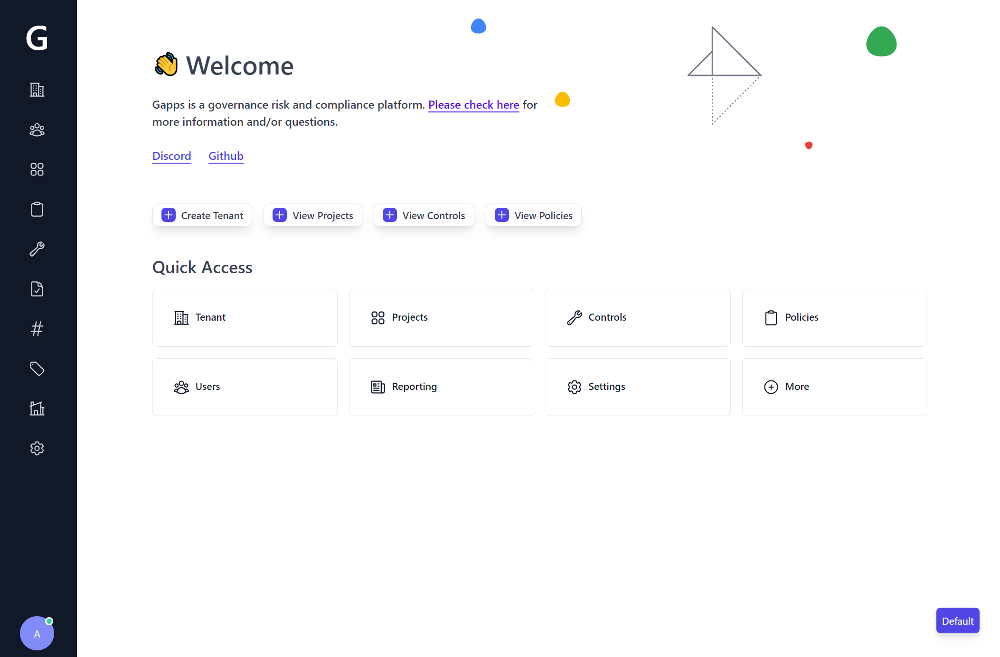
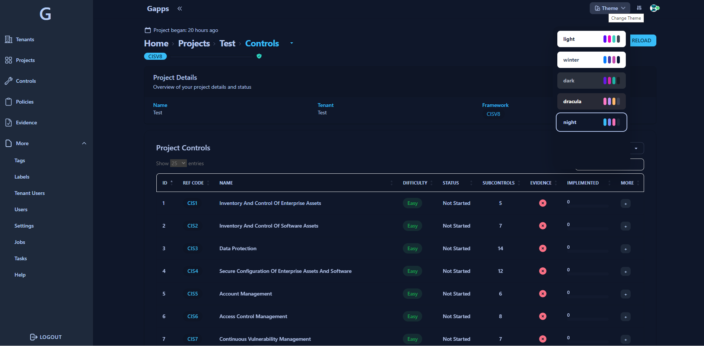
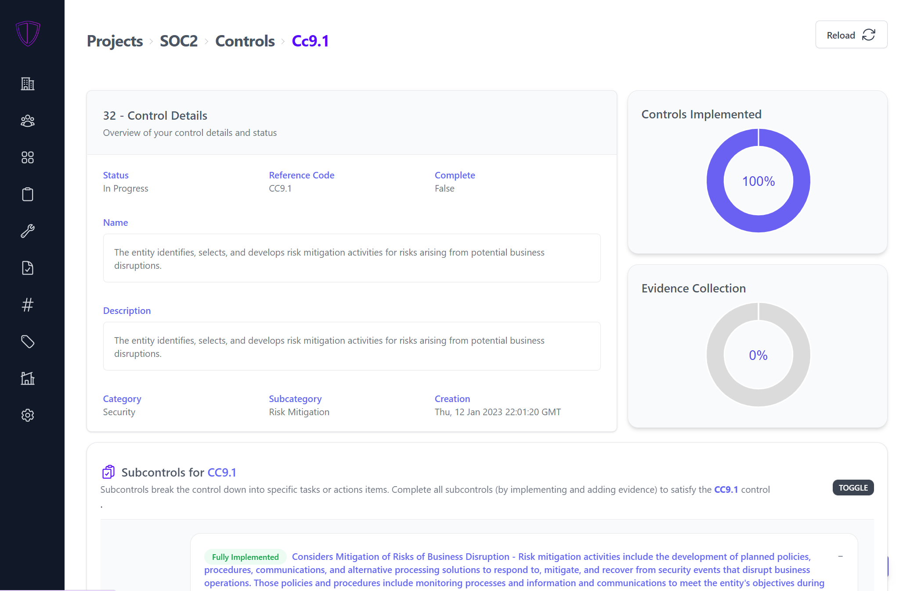

# Gapps

:snowflake: View the [Gapps site](https://web-gapps.pages.dev/)

### Table of Contents
1. [About](#about)
2. [Getting Started](#getting-started)
3. [Supported Frameworks](#supported-frameworks)
4. [Roadmap](#roadmap)
5. [Things to know](#things-to-know)

- Interested in some form of partnership or new license? Contact me on [discord](https://discord.gg/9unhWAqadg)
- Stay up to date on changes: https://forms.gle/EXigxbcWTSXcPnjw7  
- Discord: https://discord.gg/9unhWAqadg

### New Features :snowflake:
- SOC2, NIST CSF, NIST-800-53, CMMC, HIPAA, ASVS, ISO27001, CSC CIS18, PCI DSS and SSF have been added! That makes 10 total frameworks
- Total revamp of the UI
- Multi-tenancy is now supported!

### Next big features :snowflake:  
- Control automation?
- Endpoint agents for compliance?
- More frameworks?
- [Take a look at the current roadmap](https://github.com/users/bmarsh9/projects/1) or [submit a issue](https://github.com/bmarsh9/gapps/issues)

### About
Gapps is an Security compliance platform that makes it easy to track your progress against various security frameworks. *Gapps is currently in Alpha mode - while it works great, there may be some breaking changes as it evolves. Please do not use this in production.... yet!*.  
- Supports 7 security compliance frameworks (more coming)  
- 1500+ controls and 25+ policies out of the box for the frameworks (majority of policies are sourced from [strongdm/comply](https://github.com/strongdm/comply))
- Track the status of each control
- Add custom controls/policies
- WYSIWYG content editor

#### Check out the intro video below!
https://user-images.githubusercontent.com/26391921/215197665-8f8f3e26-e79c-4271-8dc5-7194975f55c5.mp4


#### Captures from the platform

Home Dashboard          |
:-------------------------:|
  |

Project Controls          |
:-------------------------:|
  |

Project Controls (Dark Mode)          |
:-------------------------:|
  |

Track Progress of Controls          |
:-------------------------:|
  |

### Getting Started

##### Setting up the server with Docker in 2 minutes

The following instructions are to get you started very quickly. The image will be pulled from Docker Hub

```
$ git clone https://github.com/bmarsh9/gapps.git; cd gapps
$ export SETUP_DB=yes;docker-compose up -d
```

The server should be running on `http://<your-ip>:5000`  
The default email/password is `admin@example.com:admin`

Next, create a project and select the framework (SOC2). Based on the selected criteria, controls and policies will be automatically added to your project. You can also go to the Controls and Policies page and add them to your project.

##### Email

You can setup email (for sending user invites) as well by setting the following environment variables (docker-compose file or elsewhere)

```
MAIL_USERNAME="email@gmail.com"
MAIL_PASSWORD="app password" # https://support.google.com/accounts/answer/185833?hl=en
```

### Supported frameworks
+ SOC2
+ CMMC
+ ASVS
+ ISO27001
+ HIPAA
+ NIST CSF
+ NIST 800-53
+ CSC CIS 18
+ PCI DSS
+ SSF (custom framework "Startup Security Framework")

### Roadmap

[Take a look at the project](https://github.com/users/bmarsh9/projects/1)

### Things to know
- Authentication is fully functioning but authorization is not complete. In other words, the roles assigned to users are not respected. There is a ticket open to address this
- The mitigation details of the controls are not documented. So it won't tell you how to mitigate a specific control. This requires a ton of work to complete but there is a ticket
- Difficulty to Implement (dtc) is a field attached to the controls and every single control is labeled as "Easy" (that doesn't actually mean it is easy). This also requires a ton of work to update.

