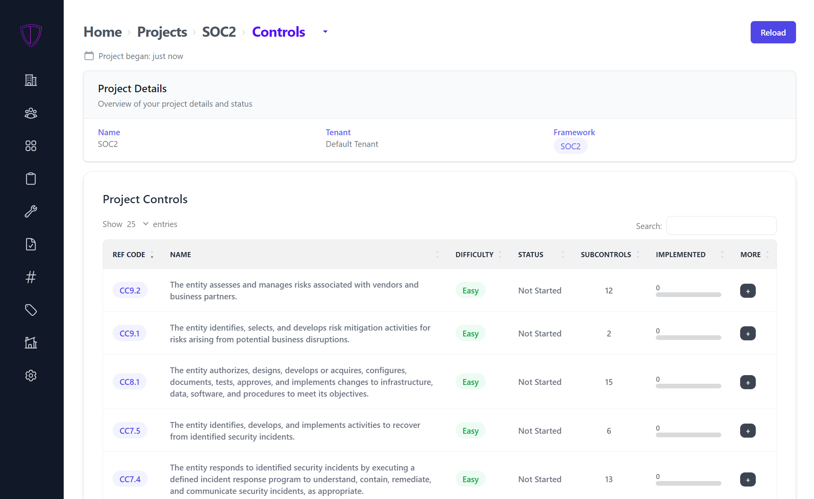

# Gapps

### Table of Contents
1. [About](#about)
2. [Getting Started](#getting-started)
3. [Roadmap](#roadmap)

Contact me and/or stay up to date on changes: https://forms.gle/EXigxbcWTSXcPnjw7  
Discord: https://discord.gg/9unhWAqadg

### New Features :snowflake:
- NIST CSF, NIST-800-53, CMMC, HIPAA, ASVS and ISO27001 have been added!
- Total revamp of the UI
- Multi-tenancy is now supported!

### About
Gapps is an Security compliance platform that makes it easy to track your progress against various security frameworks. *Gapps is currently in Alpha mode - while it works great, there may be some breaking changes as it evolves. Please do not use this in production.... yet!*.
- 300+ controls and 25+ policies out of the box for the frameworks (majority of policies are sourced from [strongdm/comply](https://github.com/strongdm/comply))
- Track the status of each control
- Add custom controls/policies
- WYSIWYG content editor

#### Check out the intro video below!

https://user-images.githubusercontent.com/26391921/203190627-84abcaa8-70ba-47f1-a957-dae7129299a6.mp4

#### Captures from the platform

Home Dashboard          |
:-------------------------:|
  |

Project Controls          |
:-------------------------:|
  |

Track Progress          |
:-------------------------:|
  |

### Getting Started

##### Setting up the server with Docker

The following instructions are to get you started very quickly. The image will be pulled from Docker Hub

```
$ git clone https://github.com/bmarsh9/gapps.git; cd gapps
$ export SETUP_DB=yes;docker-compose up -d
```

The server should be running on `http://<your-ip>:5000`  
The default email/password is `admin@example.com:admin`

Next, create a project and select the framework (SOC2). Based on the selected criteria, controls and policies will be automatically added to your project. You can also go to the Controls and Policies page and add them to your project.

##### Email

You can setup email (for sending user invites) as well by setting the following environment variables (docker-compose file or elsewhere)

```
MAIL_USERNAME="email@gmail.com"
MAIL_PASSWORD="app password" # https://support.google.com/accounts/answer/185833?hl=en
```

### Roadmap

[Take a look at the project](https://github.com/users/bmarsh9/projects/1)
